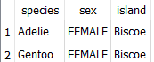
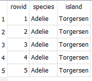
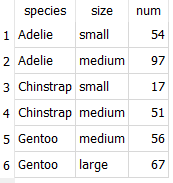
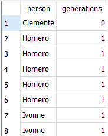

# Zadanie SQL ISI

Do sprawdzenia zapytań wykorzystywałem probram ``DB Browser for SQLite``

## 2.1 Select

- polecenie ``` sql
select * from little_penguins;```
  

  
  - polecenie ```sql
select
    species,
    island,
    sex
from little_penguins;```


- polecenie  ``select
    species,
    sex,
    island
from little_penguins
order by island asc, sex desc;``  


- plecenie ``select
    species,
    sex,
    island
from penguins
order by species, sex, island
limit 10;``  


- polecenie ``select
    species,
    sex,
    island
from penguins
order by species, sex, island
limit 10 offset 3;``


- polecenie ``select distinct
    species,
    sex,
    island
from penguins;``


- polecenie ``` sql
select distinct
    species,
    sex,
    island
from penguins
where island = 'Biscoe';```


- polecenie ``
select distinct
    species,
    sex,
    island
from penguins
where island = 'Biscoe' and sex != 'MALE';
``





- polecenie ``select
    flipper_length_mm / 10.0,
    body_mass_g / 1000.0
from penguins
limit 3;``


- polecenie ``select
    flipper_length_mm / 10.0 as flipper_cm,
    body_mass_g / 1000.0 as weight_kg,
    island as where_found
from penguins
limit 3;``


- polecenie ``select
    flipper_length_mm / 10.0 as flipper_cm,
    body_mass_g / 1000.0 as weight_kg,
    island as where_found
from penguins
limit 5;``


- polecenie ``select distinct
    species,
    sex,
    island
from penguins
where island = 'Biscoe';``


- polecenie ``select distinct
    species,
    sex,
    island
from penguins
where island = 'Biscoe' and sex = 'FEMALE';``


- polecenie ``select distinct
    species,
    sex,
    island
from penguins
where island = 'Biscoe' and sex = 'FEMALE';``  


- polecenie ``select null = null;``


- polecenie ``select
    species,
    sex,
    island
from penguins
where sex is null;``  


- polecenie ``select sum(body_mass_g) as total_mass
from penguins;``


- polecenie ``select
    max(bill_length_mm) as longest_bill,
    min(flipper_length_mm) as shortest_flipper,
    avg(bill_length_mm) / avg(bill_depth_mm) as weird_ratio
from penguins;``


- polecenie ``select
    count(*) as count_star,
    count(sex) as count_specific,
    count(distinct sex) as count_distinct
from penguins;``


- polecenie ``select avg(body_mass_g) as average_mass_g
from penguins
group by sex;``


- polecenie ``select
    sex,
    avg(body_mass_g) as average_mass_g
from penguins
group by sex;``  


- polecenie ``select
    sex,
    body_mass_g
from penguins
group by sex;``


- polecenie ``select
    sex,
    avg(body_mass_g) as average_mass_g
from penguins
group by sex
having average_mass_g > 4000.0;``


- polcenie ``select
    sex,
    round(avg(body_mass_g), 1) as average_mass_g
from penguins
group by sex
having average_mass_g > 4000.0;``


- polecenie ``select
    sex,
    round(
        avg(body_mass_g) filter (where body_mass_g < 4000.0),
        1
    ) as average_mass_g
from penguins
group by sex;``


- polecenie ``select *
from penguins cross join little_penguins;``


- polecenie ``delete from work
where person = 'tae';
select * from work;``


- polecenie ``select *
from work cross join job;``


- polecenie ``select
    work.person,
    sum(job.billable) as pay
from work inner join job
    on work.job = job.name
group by work.person;``


- polecenie ``select *
from work left join job
    on work.job = job.name;``


# Tools

- polecenie ``select distinct person
from work
where job != 'calibrate';``


- polecenie ``select *
from work
where person not in ('mik', 'tay');``


- polecenie ``select distinct person
from work
where person not in (
    select distinct person
    from work
    where job = 'calibrate'
);``


- polecenie ``create table lab_equipment (
    size real not null,
    color text not null,
    num integer not null,
    primary key (size, color)
);
insert into lab_equipment values
(1.5, 'blue', 2),
(1.5, 'green', 1),
(2.5, 'blue', 1);
select * from lab_equipment;
insert into lab_equipment values
(1.5, 'green', 2);``


- polecenie ``alter table job
add ident integer not null default -1;
update job
set ident = 1
where name = 'calibrate';
update job
set ident = 2
where name = 'clean';
select * from job;``


- polecenie ``create table new_work (
    person_id integer not null,
    job_id integer not null,
    foreign key (person_id) references person (ident),
    foreign key (job_id) references job (ident)
);
insert into new_work
select
    person.ident as person_id,
    job.ident as job_id
from
    (person inner join work on person.name = work.person)
    inner join job on job.name = work.job;
select * from new_work;``
- 


- polecenie ``select body_mass_g
from penguins
where
    body_mass_g > (
        select avg(body_mass_g)
        from penguins
    )
limit 5;``


- polecenie ``select
    penguins.species,
    penguins.body_mass_g,
    round(averaged.avg_mass_g, 1) as avg_mass_g
from penguins inner join (
    select
        species,
        avg(body_mass_g) as avg_mass_g
    from penguins
    group by species
) as averaged
    on penguins.species = averaged.species
where penguins.body_mass_g > averaged.avg_mass_g
limit 5;``


- polecenie ``select
    rowid,
    species,
    island
from penguins
limit 5;``




- polecenie ``with sized_penguins as (
    select
        species,
        iif(
            body_mass_g < 3500,
            'small',
            'large'
        ) as size
    from penguins
    where body_mass_g is not null
)
select
    species,
    size,
    count(*) as num
from sized_penguins
group by species, size
order by species, num;``


- polecenie ``with sized_penguins as (
    select
        species,
        case
            when body_mass_g < 3500 then 'small'
            when body_mass_g < 5000 then 'medium'
            else 'large'
        end as size
    from penguins
    where body_mass_g is not null
)
select
    species,
    size,
    count(*) as num
from sized_penguins
group by species, size
order by species, num;``




- polecenie ``with sized_penguins as (
    select
        species,
        case
            when body_mass_g between 3500 and 5000 then 'normal'
            else 'abnormal'
        end as size
    from penguins
    where body_mass_g is not null
)
select
    species,
    size,
    count(*) as num
from sized_penguins
group by species, size
order by species, num;``


- polecenie ``select * from staff;``


- polecenie ``select
    personal,
    family
from staff
where personal like '%ya%';``


- polecenie ``select * from (
    select * from (select * from experiment order by started asc limit 5)
    union all
    select * from (select * from experiment order by started desc limit 5)
)
order by started asc;``


- polecenie ``select
    personal,
    family,
    dept,
    age
from staff
where dept = 'mb'
intersect
select
    personal,
    family,
    dept,
    age from staff
where age < 50;``


- polecenie ``select
    personal,
    family,
    dept,
    age
from staff
where dept = 'mb'
except
    select
        personal,
        family,
        dept,
        age from staff
    where age < 50;``


- polecenie ``with decorated as (
    select random() as rand,
    personal || ' ' || family as name
    from staff
)

select
    rand,
    abs(rand) % 10 as selector,
    name
from decorated
where selector < 5;``


- polecenie ``explain query plan
select filename
from plate
where filename like '%07%';
create index plate_file on plate(filename);
explain query plan
select filename
from plate
where filename like '%07%';``


- polecenie ``with person as (
    select
        ident,
        personal || ' ' || family as name
    from staff
)
select
    left_person.name,
    right_person.name
from person as left_person inner join person as right_person
on left_person.ident < right_person.ident
where left_person.ident <= 4 and right_person.ident <= 4;``


- polecenie ``with
person as (
    select
        ident,
        personal || ' ' || family as name
    from staff
),
together as (
    select
        left_perf.staff as left_staff,
        right_perf.staff as right_staff
    from performed as left_perf inner join performed as right_perf
        on left_perf.experiment = right_perf.experiment
    where left_staff < right_staff
)
select
    left_person.name as person_1,
    right_person.name as person_2
from person as left_person inner join person as right_person join together
    on left_person.ident = left_staff and right_person.ident = right_staff;``


- polecenie ``select
    name,
    building
from department
where
    exists (
        select 1
        from staff
        where dept = department.ident
    )
order by name;``


- polecenie ``select
    name,
    building
from department
where
    not exists (
        select 1
        from staff
        where dept = department.ident
    )
order by name;``


- polecenie ``select distinct
    department.name as name,
    department.building as building
from department inner join staff
    on department.ident = staff.dept
order by name;``


- polecenie ``with ym_num as (
    select
        strftime('%Y-%m', started) as ym,
        count(*) as num
    from experiment
    group by ym
)
select
    ym,
    lag(num) over (order by ym) as prev_num,
    num,
    lead(num) over (order by ym) as next_num
from ym_num
order by ym;``


- polecenie ``with ym_num as (
    select
        strftime('%Y-%m', started) as ym,
        count(*) as num
    from experiment
    group by ym
)
select
    ym,
    num,
    sum(num) over (order by ym) as num_done,
    (sum(num) over (order by ym) * 1.00) / (select sum(num) from ym_num) as completed_progress,
    cume_dist() over (order by ym) as linear_progress
from ym_num
order by ym;``


- polecenie ``explain query plan
with ym_num as (
    select
        strftime('%Y-%m', started) as ym,
        count(*) as num
    from experiment
    group by ym
)
select
    ym,
    num,
    sum(num) over (order by ym) as num_done,
    cume_dist() over (order by ym) as progress
from ym_num
order by ym;``


- polecenie ``with y_m_num as (
    select
        strftime('%Y', started) as year,
        strftime('%m', started) as month,
        count(*) as num
    from experiment
    group by year, month
)
select
    year,
    month,
    num,
    sum(num) over (partition by year order by month) as num_done
from y_m_num
order by year, month;``


- polecenie ``select * from machine;``


- polecenie ``select
    ident,
    json_each.key as key,
    json_each.value as value
from usage, json_each(usage.log)
limit 10;``


- polecenie ``select
    ident,
    name,
    json_set(details, '$.sold', json_quote('2024-01-25')) as updated
from machine;``


- polecenie ``select
    species,
    count(*) as num
from penguins
group by species;``


- polecenie ``alter table penguins
add active integer not null default 1;
update penguins
set active = iif(species = 'Adelie', 0, 1);
select
    species,
    count(*) as num
from penguins
where active
group by species;``


- polecenie ``create table lineage (
    parent text not null,
    child text not null
);
insert into lineage values
('Arturo', 'Clemente'),
('Darío', 'Clemente'),
('Clemente', 'Homero'),
('Clemente', 'Ivonne'),
('Ivonne', 'Lourdes'),
('Soledad', 'Lourdes'),
('Lourdes', 'Santiago');
select * from lineage;``


- polecenie ``with recursive descendent as (
    select
        'Clemente' as person,
        0 as generations
    union all
    select
        lineage.child as person,
        descendent.generations + 1 as generations
    from descendent inner join lineage
        on descendent.person = lineage.parent
)
select
    person,
    generations
from descendent;``



# Skrypt

```python

import sqlite3

db_path = '/db/penguins.db'
connection = sqlite3.connect(db_path)
cursor = connection.execute("select count(*) from penguins;")
rows = cursor.fetchall()
print(rows)
```

wynik:


```python
import sqlite3

db_path = 'C:/Users/zbign/Desktop/ISI__LAB/sql-tutorial/db/penguins.db'
connection = sqlite3.connect(db_path)
cursor = connection.cursor()
cursor = cursor.execute("select species, island from penguins limit 5;")
while row := cursor.fetchone():
    print(row)
```


```python
 connection = sqlite3.connect(":memory:")
    cursor = connection.cursor()
    cursor.execute("create table example(num integer);")

    cursor.execute("insert into example values (10), (20);")
    print("after insertion", cursor.execute("select * from example;").fetchall())

    cursor.execute("delete from example where num < 15;")
    print("after deletion", cursor.execute("select * from example;").fetchall())

```


```python
connection = sqlite3.connect(":memory:")
cursor = connection.cursor()
cursor.execute("create table example(num integer);")

cursor.executemany("insert into example values (?);", [(10,), (20,)])
print("after insertion", cursor.execute("select * from example;").fetchall())
```


```python
SETUP = """\
drop table if exists example;
create table example(num integer);
insert into example values (10), (20);
"""

connection = sqlite3.connect(":memory:")
cursor = connection.cursor()
cursor.executescript(SETUP)
print("after insertion", cursor.execute("select * from example;").fetchall())
```


```python
SETUP = """\
create table example(num integer check(num > 0));
insert into example values (10);
insert into example values (-1);
insert into example values (20);
"""

connection = sqlite3.connect(":memory:")
cursor = connection.cursor()
try:
    cursor.executescript(SETUP)
except sqlite3.Error as exc:
    print(f"SQLite exception: {exc}")
print("after execution", cursor.execute("select * from example;").fetchall())
```


```python
SETUP = """\
create table example(num integer);
insert into example values (-10), (10), (20), (30);
"""


def clip(value):
    if value < 0:
        return 0
    if value > 20:
        return 20
    return value


connection = sqlite3.connect(":memory:")
connection.create_function("clip", 1, clip)
cursor = connection.cursor()
cursor.executescript(SETUP)
for row in cursor.execute("select num, clip(num) from example;").fetchall():
    print(row)
```


```python
# Convert date to ISO-formatted string when writing to database
def _adapt_date_iso(val):
    return val.isoformat()


sqlite3.register_adapter(date, _adapt_date_iso)


# Convert ISO-formatted string to date when reading from database
def _convert_date(val):
    return date.fromisoformat(val.decode())


sqlite3.register_converter("date", _convert_date)

SETUP = """\
create table events(
    happened date not null,
    description text not null
);
"""

connection = sqlite3.connect(":memory:", detect_types=sqlite3.PARSE_DECLTYPES)
cursor = connection.cursor()
cursor.execute(SETUP)

cursor.executemany(
    "insert into events values (?, ?);",
    [(date(2024, 1, 10), "started tutorial"), (date(2024, 1, 29), "finished tutorial")],
)

for row in cursor.execute("select * from events;").fetchall():
    print(row)
```


```python
db_path = 'C:/Users/zbign/Desktop/ISI__LAB/sql-tutorial/db/penguins.db'
        connection = sqlite3.connect(db_path)
        query = "select species, count(*) as num from penguins group by species;"
        df = pd.read_sql(query, connection)
        print(df)
```


```python

class Department(SQLModel, table=True):
    ident: str = Field(default=None, primary_key=True)
    name: str
    building: str


db_uri = "sqlite:///C:/Users/zbign/Desktop/ISI__LAB/sql-tutorial/db/assays.db"
engine = create_engine(db_uri)
with Session(engine) as session:
    statement = select(Department)
    for result in session.exec(statement).all():
        print(result)
```


```python
class Staff(SQLModel, table=True):
    ident: str = Field(default=None, primary_key=True)
    personal: str
    family: str
    dept: Optional[str] = Field(default=None, foreign_key="department.ident")
    age: int


class Department(SQLModel, table=True):
    ident: str = Field(default=None, primary_key=True)
    name: str
    building: str


db_uri = "sqlite:///C:/Users/zbign/Desktop/ISI__LAB/sql-tutorial/db/assays.db"
engine = create_engine(db_uri)
SQLModel.metadata.create_all(engine)
with Session(engine) as session:
    statement = select(Department, Staff).where(Staff.dept == Department.ident)
    for dept, staff in session.exec(statement):
        print(f"{dept.name}: {staff.personal} {staff.family}")
```


